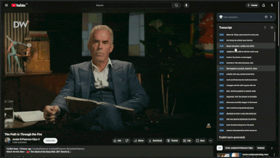

<div align="center">
  
  <h1>chep</h1>
  <p>
    <strong>Chat with AI about any YouTube video. Ask questions, get summaries, and learn more while you watch.</strong>
  </p>

  <p>
    <a href="https://addons.mozilla.org/en-US/firefox/addon/chep/">
      
    </a>
    <a href="https://chep-ai.vercel.app/">
      
    </a>
  </p>
</div>

<div align="center">
  
</div>

## ✨ Features

- **💬 Instant Chat**: Ask questions and get immediate AI responses about any video content
- **⏰ Time Links**: AI answers include timestamps so you can jump to the right part of the video easily
- **⚡ Slash Commands**: Quick shortcuts for common prompts - type `/` to see options like `/summary`, `/explain`, or create your own
- **🤖 Different AI Options**: Works with OpenAI, Google Gemini, and OpenRouter using your own API keys
- **🎯 Easy to Use**: Works right on YouTube pages with a simple, clean design that stays out of your way
- **🔒 Private**: Your chats stay between you and the AI service you pick. We don't save your data

## 🚀 Installation

### Option 1: Firefox Add-ons Store (Recommended)
1. Visit the [Firefox Add-ons Store](https://addons.mozilla.org/en-US/firefox/addon/chep/)
2. Click **"Add to Firefox"**
3. Follow the setup instructions
4. Start chatting on any YouTube video!

### Option 2: Install from Source
```bash
# Clone the repository
git clone https://github.com/Jimuelzxc/chep.git
cd chep

# Load in Firefox
# 1. Open Firefox and go to about:debugging
# 2. Click "This Firefox"
# 3. Click "Load Temporary Add-on"
# 4. Select the manifest.json file
```

> **Note**: The extension is completely free, but you'll need your own API key from one of the supported AI providers.

## 🚀 How to Use chep

### 1. Get Your API Key (We recommend Google Gemini)

To use chep, you need an API key from a supported AI provider. We strongly recommend Google Gemini because it's easy to set up and offers a generous free tier.

**How to get your Google Gemini API Key:**

1. Go to the [Google AI Studio](https://aistudio.google.com/app/apikey).
2. Click on **"Get API key"**.
3. Sign in with your Google account if prompted.
4. Click **"Create API key in new project"**.
5. Your API key will be generated. Copy it to your clipboard.

For other options, you can also use keys from [OpenAI](https://platform.openai.com/api-keys) or [OpenRouter](https://openrouter.ai/).

### 2. Configure chep in YouTube

After installing the extension and getting your API key, you're ready to start chatting!

1. Go to any YouTube video.
2. You'll find the **chep AI Companion** panel on the right side of the page, below the video details.
3. Click the **Settings icon (⚙️)** in the chep panel header to open the configuration menu.
4. Select your **AI Provider** (e.g., Google Gemini, OpenAI) from the dropdown menu.
5. Paste your **API Key** into the corresponding input field.
6. Click **"Save Changes"**.
7. That's it! You can now close the settings and start asking questions about the video in the chatbox.


## 🤝 Contributing

We welcome contributions! Here's how you can help:

1. **🍴 Fork** the repository
2. **🌿 Create** a feature branch: `git checkout -b feature/amazing-feature`
3. **✅ Test** your changes on various YouTube videos
4. **📝 Commit** your changes: `git commit -m 'Add amazing feature'`
5. **🚀 Push** to the branch: `git push origin feature/amazing-feature`
6. **📬 Submit** a pull request

### 🐛 Bug Reports
Found a bug? Please [open an issue](https://github.com/Jimuelzxc/chep/issues) with:
- Steps to reproduce
- Expected vs actual behavior
- Browser version and OS
- Screenshots if applicable

## 📄 License

This project is licensed under the MIT License - see the [LICENSE](LICENSE) file for details.

## 🙏 Acknowledgments

- Thanks to all the AI providers for their APIs
- Firefox extension community for guidance
- All contributors and users who help improve chep

---

<div align="center">
  <p>Made with ❤️ for YouTube enthusiasts</p>
  <p>
    <a href="https://chep-ai.vercel.app/">Website</a> • 
    <a href="https://addons.mozilla.org/en-US/firefox/addon/chep/">Firefox Store</a> • 
    <a href="https://github.com/Jimuelzxc/chep/issues">Report Bug</a>
  </p>
</div>
